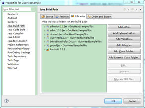
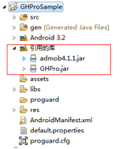
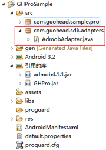

本文档用于 Android 开发者在应用中整合果合移动广告 SDK。

## 配置果合 SDK

### SDK 文件内容

文件集中包含有：

<table>
	<thead>
		<tr>
			<th>文件名称</th>
			<th>文件内容</th>
		</tr>
	</thead>
	<tbody>
		<tr>
			<td>Libs 文件夹</td>
			<td>果合 Android SDK 和平台广告 SDK</td>
		</tr>
		<tr>
			<td>Demo 文件夹</td>
			<td>果合 Android SDK 程序样例</td>
		</tr>
		<tr>
			<td>Adapters 文件夹</td>
			<td>广告平台 SDK 和果合提供的适配开放源码</td>
		</tr>
		<tr>
			<td>GuoHe_Integration_Android.pdf</td>
			<td>Android SDK更新日志（本文档）</td>
		</tr>
		<tr>
			<td>gh_closebutton.png</td>
			<td>关闭按钮图片</td>
		</tr>
	</tbody>
</table>

### 添加果合 SDK 文件到你的工程中

将文件集中的libs文件夹复制到项目工程的根目录下。
打开Eclipse，右键点击项目，弹出菜单中选择“Properties(属性)”，选择左侧的“Java Build Path(Java 构建路径)”，然后选择“Libraries(库)”选项卡，点击“Add JARS...(添加JAR...)”，选择项目中的libs文件夹下的Guohe.jar，如果你需要使用平台广告，则还需要选择相应的平台广告的jar包。点击“OK(确定)”.此时项目下的"Referenced Libraries(引入的库)" 应包含Guohe.jar，以及已选择的平台广告的jar包。相关截图如下：

## 在您的工程代码中使用果合SDK

### 添加相应文件

#### 添加 Adapter 文件

如果您只想开通品牌广告或者自主广告，请忽略此步骤。
如果您想开通平台广告，则右键点击项目，选择”New（新建）“，弹出菜单中选择“Package（包）”，在“Name(名称)”中输入：com.guohead.sdk.adapters，点击“Finish（完成）”。在下载的文件集中的Adapters文件夹下找到您想要开通的平台广告对应的Adapter类，将其复制到项目的com.guohead.sdk.adapters包下。相关截图如下：

注：您也可以通过项目引用等方式引入需要的Adapter文件，该方法可以查看网上相关资料，此处不再赘述。

#### 添加关闭按钮图片

将文件集中的图片文件 gh_closebutton.png 复制到项目的 drawable 文件夹下。

### 创建广告位

#### 用 XML 布局

在 XML 布局文件中适当位置添加如下代码创建广告位：

	<com.guohead.sdk.GHView android:id="@+id/mGHView_1" android:layout_height="wrap_content" android:layout_width="wrap_content"></com.guohead.sdk.GHView>

注：果合 Android SDK 1.1版本增加了广告位关闭按钮的设置，开发着在网站上创建/编辑广告位时可以为广告位设置关闭按钮样式为“广告位内”、“右上角”、“无”。

#### 用代码布局

	GHView  ghView_1=new GHView(this);                             
	ghView_1.setAdUnitId("果合ID");                                 
	ghView_1.startLoadAd();                                     

将 ghView_1 添加到你想要的地方。

### 初始化广告位，请求广告

在 Java 文件中嵌入如下代码进行广告位的初始化：

	GHView ghView_1;
	...
	ghView_1 = (GHView) findViewById(R.id.mGHView_1);
	ghView_1.setAdUnitId("广告位ID");//设置广告位ID
	ghView_1.startLoadAd();//请求广告

注意：

1. 将您在果合网站上获得到的广告位 ID，替换上述代码中的"广告位ID"。
2. 该初始化广告位代码通常放在 Activity 的 onCreate() 方法中。

当界面退出时，需停止广告位请求广告，应该在 Activity 的 onDestroy() 方法中调用 destroy() 方法。代码如下：

	protected void onDestroy() {
		// TODO Auto-generated method stub
		super.onDestroy();
		ghView_1.destroy();
	}

### 设置 AndroidManifest.xml 文件

#### 添加权限

在 AndroidManifest.xml 文件的 \</manifest\> 标签前添加如下代码。

	<uses-permission android:name="android.permission.INTERNET" />
	<uses-permission android:name="android.permission.READ_PHONE_STATE" />

如果您需要使用平台广告，还需要根据各平台文档要求选择性地添加如下权限：

	<uses-permission android:name="android.permission.ACCESS_NETWORK_STATE" />
	<uses-permission android:name="android.permission.ACCESS_COARSE_LOCATION" />
	<uses-permission android:name="android.permission.ACCESS_FINE_LOCATION" />
	<uses-permission android:name="android.permission.READ_LOGS" />
	<uses-permission android:name="android.permission.WRITE_EXTERNAL_STORAGE" />
	<uses-permission android:name="android.permission.ACCESS_WIFI_STATE" />
	<uses-permission android:name="android.permission.READ_EXTERNAL_STORAGE" />
	<uses-permission android:name="android.permission.CALL_PHONE" />
	<!--哇棒还需要下面的权限-->
	<uses-permission android:name="android.permission.READ_SMS" />
	<uses-permission android:name="android.permission.READ_CONTACTS" />

注：若有疑问，请查看相关平台 SDK 开发文档。

#### 添加 Activity 声明

如果您只想开通品牌广告或者自主广告，请忽略此步骤。
根据您想开通的平台广告，复制下面对应的 Activity 声明代码，粘贴到 \</application\> 标签前。

有米广告
	<!-- youmi begin -->
	<activity
		android:configChanges="keyboard|keyboardHidden|orientation"
		android:name="net.youmi.android.AdActivity">
	</activity>
	<!-- youmi end -->

多盟广告
	<!-- domob begin -->
	<activity
		android:name="cn.domob.android.ads.DomobActivity"
		android:theme="@android:style/Theme.Translucent" />
	<!-- domob end -->

AdMob
	<!-- AdMob begin -->
	<activity
		android:configChanges="orientation|keyboard|keyboardHidden"
		android:name="com.google.ads.AdActivity" />
	<!-- AdMob end -->

AdWo 安沃广告
	<!-- Adwo begin -->
	<activity android:name="com.adwo.adsdk.AdwoAdBrowserActivity" />
	<!-- Adwo end -->

InMobi
	<!-- Inmobi begin -->
	<activity
		android:configChanges="keyboardHidden|orientation|keyboard"
		android:name="com.inmobi.androidsdk.IMBrowserActivity" />
	<!-- Inmobi end -->

百度
	<!-- Baidu begin -->
	<meta-data
		android:name="BaiduMobAd_APP_ID"
		android:value="debug" />
	<meta-data
		android:name="BaiduMobAd_APP_SEC"
		android:value="debug" />
	<activity
		android:configChanges="keyboardHidden|orientation|keyboard"
		android:name="com.baidu.AppActivity">
	</activity>
	<!-- Baidu end -->

Vpon
	<!-- Vpon begin -->
	<activity android:configChanges="orientation|keyboardHidden|navigation|keyboard"
		android:label="@string/app_name"
		android:name="com.vpon.adon.android.WebInApp"
		android:screenOrientation="portrait" />
	<!-- vpon end -->

哇棒广告
	<!-- wooboo begin -->
	<activity
		android:configChanges="orientation|keyboardHidden"
		android:name="com.wooboo.adlib_android.AdActivity" />
	<!-- wooboo end -->

Millennial Media
	<!-- Millennial Media begin -->
	<activity
		android:configChanges="keyboardHidden|orientation|keyboard"
		android:name="com.millennialmedia.android.MMAdViewOverlayActivity" >
	</activity>
	<activity
		android:configChanges="keyboardHidden|orientation|keyboard"
		android:name="com.millennialmedia.android.VideoPlayer" >
	</activity>
	<!-- Millennial Media end -->

## 监听广告位状态（可选）

可以根据需要对每个广告位的状态进行监听，以便做出相应的处理。果合SDK提供了完善的监听机制。
果合 SDK 提供了如下监听接口：

	//监听广告展示前的状态。
	public interface OnAdWillLoadListener {
		public void OnAdWillLoad(GHView m, String url);
	}
	//监听请求到广告的状态
	public interface OnAdLoadedListener {
		public void OnAdLoaded(GHView m);
	}
	//监听广告请求失败状态
	public interface OnAdFailedListener {
		public void OnAdFailed(GHView m);
	}
	//监听广告关闭状态
	public interface OnAdClosedListener {
		public void OnAdClosed(GHView m);
	}
	//监听广告点击状态
	public interface OnAdClickedListener {
		public void OnAdClicked(GHView m);
	}

例如，如果你想要监听广告被点击事件，可以在适当位置加入如下类似代码：

	ghView.setOnAdClickedListener(new OnAdClickedListener() 	{
		@Override
		public void OnAdClicked(GHView arg0) {
			Log.i("TAG","OnAdClicked");
		}
	});

监听其他状态类似，具体您可以参看 Demo 中的代码，在此不再赘述。
注意：由于很多广告平台没有提供监听广告被点击的接口，所以我们的 SDK 对广告点击的统计不是很精确。

## 设置自定义定向（可选）

对应 Web 端提供的自定义定向功能(参见注解)，SDK 端提供用户为广告位设置自定义定向字段的方法。只需在相应的位置添加如下代码即可，对应的 Target Key 需要开发者定义。

	ghView.setKeywords("Target Key ");

自定义定向功能: 用以满足应用的特殊目标定向的需求 。用户可以在Web端为广告定义多个自定义定向字段(以逗号分隔，例如key1,key2)；在应用中，可以通过为广告位设置一个自定义定向字段(例如key1)对用户群做定向投放。规则举例: 广告A设置的自定义定向字段为key1,key2，用户群a设置的定向字段为key1，用户群b未设置定向字段，用户群c设置定向字段为key2，则a和c可以看到广告A，b则看不到。

## 附录：GHView 接口列表

<table>
	<tr>
		<td>startLoadAd()</td>
		<td>开始请求广告</td>
	</tr>
	<tr>
		<td>pauseLoadAd()</td>
		<td>暂停请求广告，即暂停广告之间的切换。（注意：如果使用平台广告，最后显示的广告平台SDK若有自动刷新逻辑，这个广告平台将会继续刷新它自己的广告。果合SDK只暂停果合广告平台或者平台广告的切换。）</td>
	</tr>
	<tr>
		<td>restartLoadAd()</td>
		<td>重新请求广告，即重新开始广告之间的切换。</td>
	</tr>
	<tr>
		<td>setAdUnitId("广告位ID ")</td>
		<td>在开始请求广告之前必须设置广告位ID才能正确请求广告。</td>
	</tr>
	<tr>
		<td>setOnxxxListener</td>
		<td>设置广告状态监听器，详情请看监听广告位状态。</td>
	</tr>
</table>