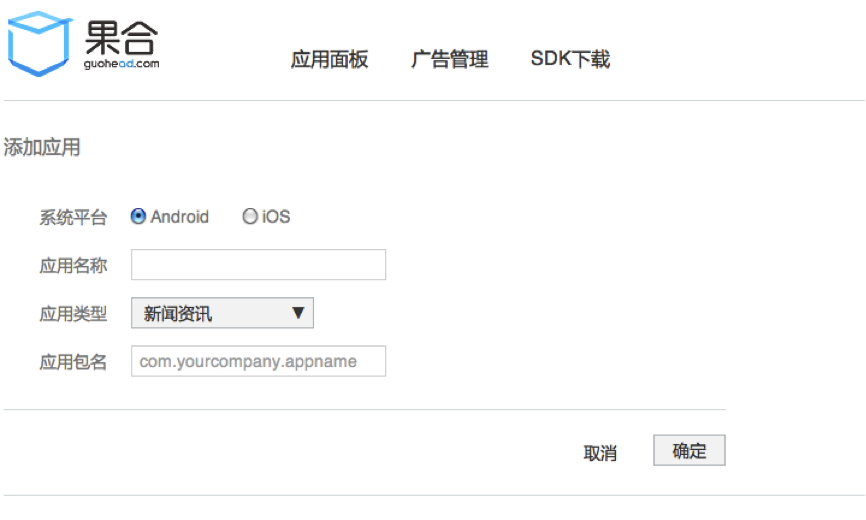
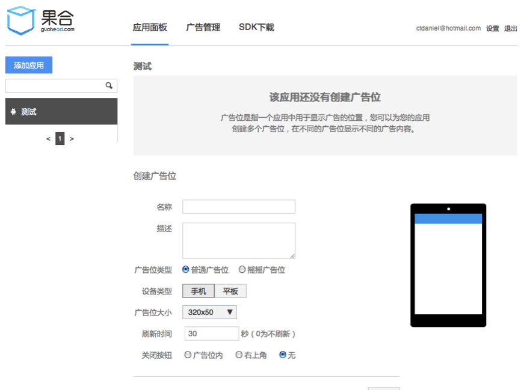
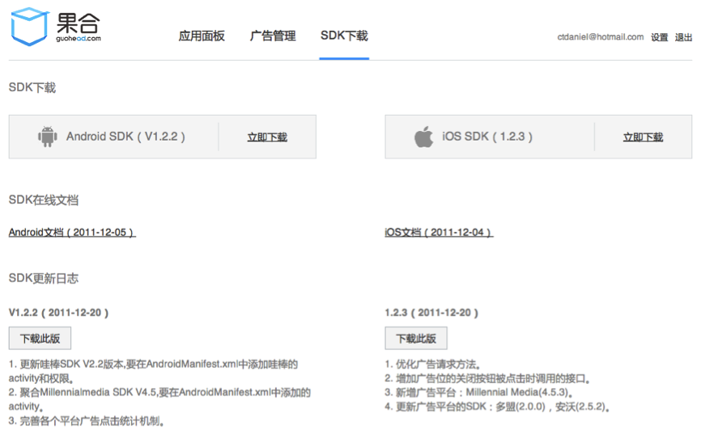
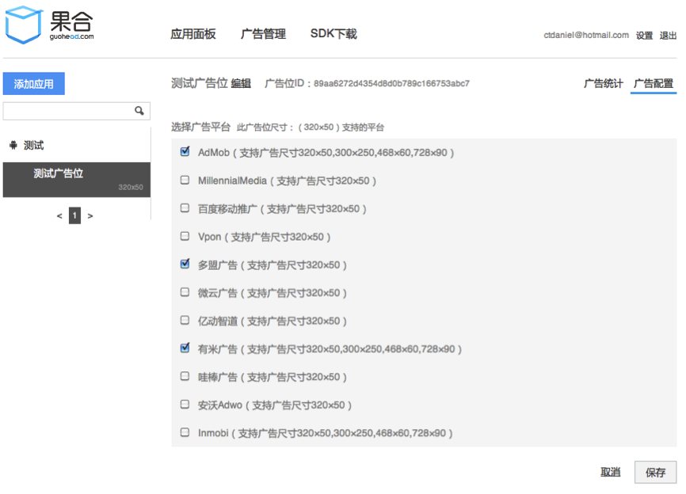
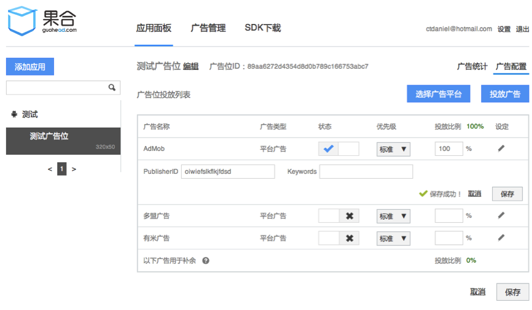

## 果合新手详细使用文档

### 添加应用

注册成功，并登陆后，点击“添加应用”按钮进入如下图所示的填写应用信息页面。

### 添加广告位

广告位是指一个应用中用于显示广告的位置，您可以为您的应用创建多个广告位，在不同的广告位显示不同的广告内容。添加应用完成后，您需要至少为您的应用添加一个广告位。摇摇广告位为初始隐藏，摇晃才会出现的广告位。

### 集成果合 SDK

广告位添加完成后，会提示简单的集成说明，这时你需要点击“SDK下载”进入SDK 下载页面，[下载果合SDK (Android / iOS)](http://guohead.com/changelog)，并严格按照SDK使用文档集成果合 SDK。下载页面如下图:

### 配置广告

集成好果合SDK后，您还需要在果合网站上配置广告。选择一个广告位，点击右侧“广告配置”链接，进入如下图的广告配置页面。

在广告配置页面，您可以选择广告平台(Admob 等)，也可以投放自己的自主广告。点击“选择广告平台”按钮，如下图，选择您想要使用的广告平台。

选择完成后点击保存，你将看到如下图见面，这时，您需要配置您的应用在各自广告平台上的唯一 ID，并设置广告分配比例。

您也可以点击“投放广告”并选择一个自主广告在您的广告位上显示，如下图。

